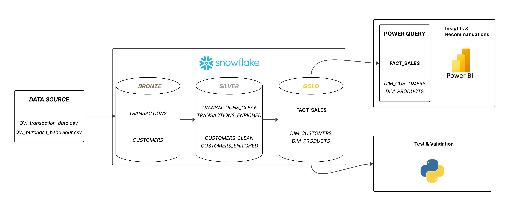

# Retail Analytics — Data-Driven Growth Strategy

<p align="center">
  <a href="https://poce-my.sharepoint.com/:b:/g/personal/nicolas_meny_edu_ece_fr/IQAiXYSGYE5ISrtM0Fsn4d9VAWs47_SbmkFd4yXlWDk_CAc?e=Ke0y8G">
    
  </a>
</p>

---
## About

**End-to-end data analytics project** based on **Quantium Data Analytics Job Simulation on Forage** — a retail analytics case covering customer segmentation, product recommendations and statistical impact measurement. 

**Result: +8.5% revenue lift** on the test store, validated at **99.4% statistical confidence**.

---

## Approach

<p align="center">
  
</p>

**1. Data Engineering · Snowflake + SQL** — raw CSV ingestion, cleaning and enrichment via a **Medallion Architecture (Bronze → Silver → Gold)**, **star schema modelling** optimised for BI querying. All transformations are written in SQL and hosted on Snowflake.

**2. Data Analytics · Power BI** — customer segment analysis across consumption patterns (volume vs. unit price), product affinity scoring via Lift, and definition of three targeted activation recommendations by segment.

**3. Statistical Evaluation · Python** — control store selection via profile filtering and Pearson correlation, **A/B test** and revenue lift measurement across 3 test stores.

---

## Key Results

| Metric | Value |
|---|---|
| Validated Revenue Lift | **+8.5%** (Store 88) |
| Statistical Confidence | **99.4%** (p = 0.006) |

---

## Tech Stack

| Tool | Usage |
|---|---|
| Snowflake | Data warehouse hosting the full Medallion Architecture |
| SQL | All data transformations — ingestion, cleaning and Gold layer modelling |
| Power BI | Behavioural analysis by segment and product affinity |
| Python | Store Matching, A/B test and statistical validation |

---

## Repo Structure

```
├── README.md
├── index.html              # GitHub Pages portfolio
├── data/                   # Quantium source data (transactions & customers)
├── docs/                   # Data cleaning & feature engineering documentation (Excel)
├── notebooks/              # Python analysis (Store Matching & A/B test)
└── sql/
    ├── 01_bronze/          # Raw ingestion
    ├── 02_silver/          # Cleaning & enrichment
    └── 03_gold/            # Modelling (FACT_SALES, DIM_*)
```

---

## Project Presentation

| Document | Description | Link |
|---|---|---|
| Project Showcase | Condensed 6-slide deck — segmentation, product strategy & A/B test results | [View](https://poce-my.sharepoint.com/:b:/g/personal/nicolas_meny_edu_ece_fr/IQAiXYSGYE5ISrtM0Fsn4d9VAWs47_SbmkFd4yXlWDk_CAc?e=Ke0y8G) |
| Full Analysis Report | Detailed analytical report — methodology, insights & recommendations | [View](https://poce-my.sharepoint.com/:b:/g/personal/nicolas_meny_edu_ece_fr/IQDlieCb8OYuR6biQ-cr5m38AW8h_DdW17KNNRdCyksnZd4?e=HzRXqH) |